# AEDs III - TP01

## Participantes

- Hector Faria Braz de Carvalho
- João Paulo da Silva
- Vitor Hugo Chagas Maciel
- Gabriel Lima Emerique Caldeira

## Descrição do trabalho

Este projeto implementa um sistema simplificado de perguntas e respostas, inspirado no funcionamento do StackOverflow, com foco em persistência em arquivos e uso de estruturas de indexação como tabelas hash extensíveis e árvores B+.

O sistema permite:

- cadastro de usuários;
- login com email e senha;
- recuperação de senha por meio de pergunta e resposta secreta;
- gerenciamento dos dados do usuário;
- cadastro, listagem, alteração e arquivamento de perguntas;
- relacionamento 1:N entre usuário e pergunta, mantendo a integridade dos dados.

A aplicação foi organizada em camadas para separar:

- entidades (`TP1/src/entidades`): `Usuario` e `Pergunta`;
- arquivos e índices (`TP1/src/arquivos` e `TP1/src/aed3`): CRUD, hash extensível e árvore B+;
- interfaces de interação (`TP1/src/tela`): menus e fluxos do sistema;
- ponto de entrada (`TP1/src/Main.java`): execução da aplicação.

## Prints do Projeto: 

### `Tela Inicio`
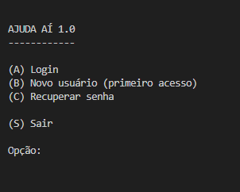

### `Tela Login`
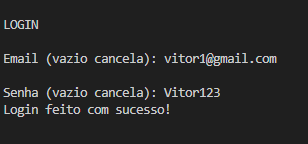

### `Tela Cadastro`
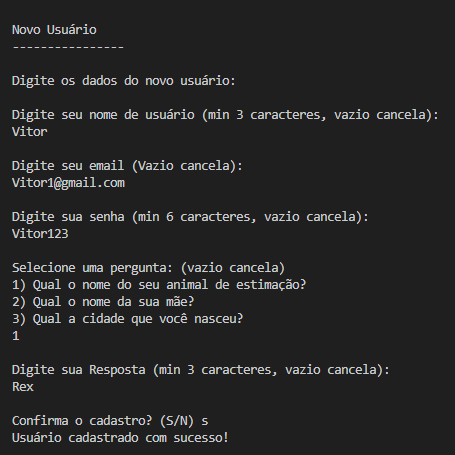

### `Tela De Recuperação de Senha`
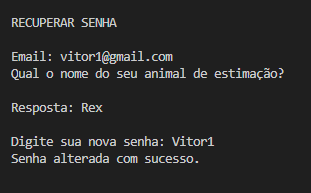

### `Tela Inicial`
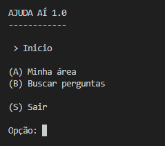

### `Tela Minhas Área`
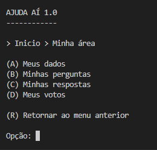

### `Tela Meus Dados`
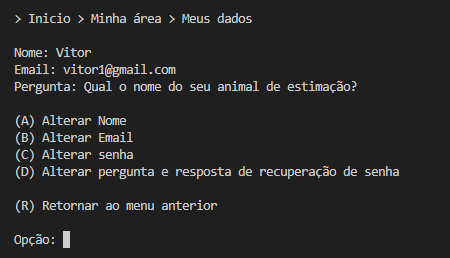

### `Tela Minhas Perguntas`
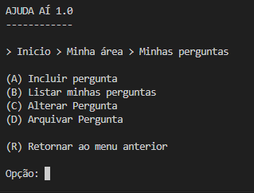

### `Tela de Cadastro de Pergunta`
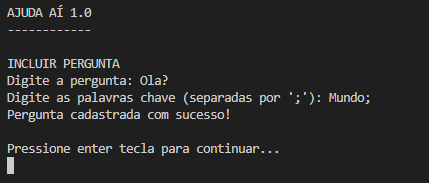

### `Tela de Listar de Pergunta`
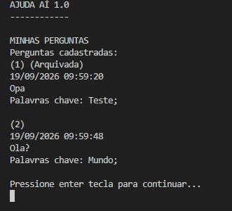

### `Tela de Atulizar de Pergunta`
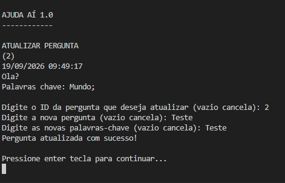

### `Tela de Arquivar de Pergunta`
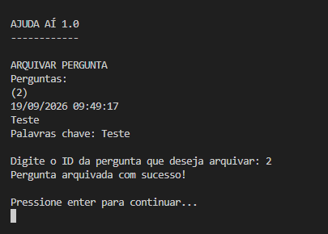

## Estrutura do projeto

```text
AEDS-III/
├── README.md
├── TP1/
│   ├── src/
│   │   ├── Main.java
│   │   ├── auxiliar/
│   │   │   └── Leitura.java
│   │   ├── entidades/
│   │   │   ├── Pergunta.java
│   │   │   └── Usuario.java
│   │   ├── arquivos/
│   │   │   ├── ArquivoPergunta.java
│   │   │   └── ArquivoUsuario.java
│   │   ├── aed3/
│   │   │   ├── Arquivo.java
│   │   │   ├── ArvoreBMais.java
│   │   │   ├── HashExtensivel.java
│   │   │   ├── InterfaceArvoreBMais.java
│   │   │   ├── InterfaceHashExtensivel.java
│   │   │   ├── InterfaceRegistro.java
│   │   │   ├── ParIDEndereco.java
│   │   │   ├── ParIdEmail.java
│   │   │   ├── ParIdId.java
│   │   │   └── ParIdUsuarioPergunta.java
│   │   └── tela/
│   │       ├── MenuPergunta.java
│   │       └── MenuUser.java
│   └── bin/
│       └── (gerada pela compilação)
└── dados/
    └── (gerada em tempo de execução para persistência dos registros)
```

## Descrição dos principais arquivos

### `TP1/src/Main.java`

Classe principal da aplicação. Inicia o sistema, chama o menu de usuário e encaminha o fluxo para a área do usuário autenticado.

### `TP1/src/entidades`

- `Usuario.java`: representa o usuário do sistema, com serialização para bytes, armazenamento de email, senha e pergunta/resposta secreta.
- `Pergunta.java`: representa uma pergunta do sistema, contendo id do usuário, data de criação/alteração, nota, texto, palavras-chave e status ativo/arquivada.

### `TP1/src/arquivos`

- `ArquivoUsuario.java`: CRUD de usuários com índice indireto por email usando `HashExtensivel<ParIdEmail>`.
- `ArquivoPergunta.java`: CRUD de perguntas com índice de relacionamento por usuário usando `ArvoreBMais<ParIdUsuarioPergunta>`.

### `TP1/src/aed3`

- `Arquivo.java`: classe genérica base para arquivos de registros, responsável por gerenciar o arquivo de dados, cabeçalho, índice por id (`ParIDEndereco`) e reutilização de espaços livres.
- `HashExtensivel.java`: implementação da tabela hash extensível.
- `ArvoreBMais.java`: implementação da árvore B+ genérica com suporte a leitura, criação, atualização e remoção de registros.
- `ParIDEndereco.java`: par `id -> endereço` usado como índice direto do arquivo de dados.
- `ParIdEmail.java`: par `email -> id` usado para localizar usuários por email.
- `ParIdUsuarioPergunta.java`: par `(idUsuario, idPergunta)` usado para representar o relacionamento 1:N entre usuário e pergunta.
- `ParIdId.java`: estrutura genérica para relacionamento entre pares de ids em árvore B+.
- `InterfaceRegistro.java`: contrato para serialização/deserialização de entidades.
- `InterfaceHashExtensivel.java`: contrato para objetos armazenáveis em hash extensível.
- `InterfaceArvoreBMais.java`: contrato para objetos armazenáveis em árvore B+.

### `TP1/src/tela`

- `MenuUser.java`: fluxo principal de login, cadastro, recuperação de senha e gerenciamento de dados do usuário.
- `MenuPergunta.java`: fluxo de inclusão, listagem, atualização e arquivamento de perguntas do usuário logado.

### `TP1/src/auxiliar`

- `Leitura.java`: centraliza a leitura de entrada do usuário pelo `System.in`.

## operações especiais que foram implementadas

### Há um CRUD de usuários (que estende a classe Arquivo, acrescentando Tabelas Hash Extensíveis e Árvores B+ como índices diretos e indiretos conforme necessidade) que funciona corretamente?
Sim. O `ArquivoUsuario` estende a classe genérica `Arquivo<Usuario>` e adiciona:

- índice por email (`HashExtensivel<ParIdEmail>`);
- validação de email duplicado;
- atualização do índice quando o email muda;
- remoção lógica do usuário e do índice associado.


### Há um CRUD de perguntas (que estende a classe Arquivo, acrescentando Tabelas Hash Extensíveis e Árvores B+ como índices diretos e indiretos conforme necessidade) que funciona corretamente?

Sim. O `ArquivoPergunta` estende `Arquivo<Pergunta>` e adiciona:

- índice de relacionamento por usuário (`ArvoreBMais<ParIdUsuarioPergunta>`);
- leitura de perguntas por usuário;
- atualização do vínculo quando o usuário da pergunta muda;
- arquivamento da pergunta em vez de exclusão física.


### As perguntas estão vinculadas aos usuários usando o idUsuario como chave estrangeira?

Sim. Cada `Pergunta` possui o campo `idUsuario`, e o `ArquivoPergunta` mantém um índice B+ com pares `(idUsuario, idPergunta)` para permitir consultas e organização do relacionamento 1:N.

### Há uma árvore B+ que registre o relacionamento 1:N entre usuários e perguntas?

Sim. A classe `ArvoreBMais.java` implementa uma árvore B+ genérica e é utilizada para o índice de perguntas por usuário (`ParIdUsuarioPergunta`).


### O trabalho está completo e funcionando sem erros de execução?

Sim. O projeto foi validado com o comando abaixo e compilou corretamente:

```bash
cd TP1
javac -d bin $(find src -name '*.java')
```

### O trabalho é original e não a cópia de um trabalho de outro grupo?

Sim. O projeto foi desenvolvido inteiramente pelo grupo e é totalmente original.

## Como rodar

### Opção 1: executar diretamente no VS Code / IntelliJ

- Abra a pasta `TP1` na IDE.
- Execute a classe `src/Main.java`.

### Opção 2: compilar e executar no terminal

No Linux/macOS, a partir da raiz do projeto:

```bash
cd TP1
javac -d bin $(find src -name '*.java')
java -cp bin Main
```
## Video do projeto: 

## Observações

- O sistema usa arquivos locais em `dados/` para persistir os registros e os índices.
- As perguntas não são removidas fisicamente; elas são arquivadas (`ativa = false`) para preservar o histórico.
- O menu principal contém a opção `Buscar perguntas`, mas neste estado atual ela ainda aparece como um placeholder e não foi implementada completamente.
- O fluxo de autenticação, cadastro, recuperação de senha e gerenciamento de perguntas já está estruturado e funcional em nível de compilação.

## Objetivo do TP

O objetivo principal deste trabalho foi aplicar os conceitos de armazenamento em arquivos, CRUD, indexação indireta, relacionamento entre entidades e estruturas de dados como hash extensível e árvore B+ em um sistema funcional de perguntas e respostas.
